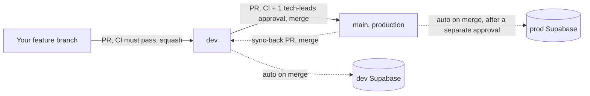

# Contributing

This is the website for Inspire Columbia, a Next.js app with a Supabase database and Clerk for staff authentication. This guide covers what a new contributor needs to get set up and start opening PRs.

## Table of contents

- [Getting started](#getting-started)
  - [Environment setup](#environment-setup)
- [How to contribute code](#how-to-contribute-code)
- [Common commands](#common-commands)
- [Testing](#testing)
  - [Setting up the local Supabase stack](#setting-up-the-local-supabase-stack)
- [Database migrations](#database-migrations)

## Getting started

1. Clone the repo and run `npm install`.
2. Set up your environment (see below) so the app has the credentials it needs to run.
3. Run `npm run dev` and open [http://localhost:3000](http://localhost:3000). If the public pages load, you're set up correctly.

### Environment setup

Copy `.env.example` to a new file called `.env.local` and fill in four values:

- `NEXT_PUBLIC_SUPABASE_URL` and `NEXT_PUBLIC_SUPABASE_PUBLISHABLE_KEY` (from the **dev** Supabase project)
- `NEXT_PUBLIC_CLERK_PUBLISHABLE_KEY` and `CLERK_SECRET_KEY` (from the Clerk **dev instance**)

Ask a `tech-leads` member for these. They're needed just to run `npm run dev` at all, not only for auth- or database-specific work, since Clerk and Supabase are both wired in at the app's root. Without them, the app won't build or start locally.

**Never use production credentials for local development.** The dev Supabase project and Clerk dev instance exist specifically so nothing you do locally can touch real user data.

Two things beyond those four variables, only needed for certain kinds of work:

- **Testing staff/admin functionality** (not just the public pages) requires an actual Clerk user account with a staff role, set up by a `tech-leads` member in the Clerk dashboard. The keys above only let the app run. They don't give any particular account a role.
- **Writing or testing database migrations** doesn't require any shared credentials if you use the local Supabase stack (`supabase start`, see Common commands below). Only pushing a migration to the shared dev project directly requires a personal Supabase CLI login plus the dev project's database password.

## How to contribute code

- `dev` is the default branch. Branch off `dev` for your work, not `main`.
- Open a PR into `dev`. It needs to pass CI (build, typecheck, lint, unit tests) before it can merge, but doesn't need anyone's approval.
- PRs into `dev` are squash merged (the default button), so don't worry about keeping your commit history clean as you work.
- Once your change is on `dev`, it gets promoted to production (`main`) periodically by a `tech-leads` member, via a separate PR that does require an approval. `main`'s merge button only offers a real merge commit, not squash, so each promoted feature stays visible as its own commit.
- Direct pushes to either `dev` or `main` are blocked for everyone, including admins. Everything goes through a PR.
- **After a promotion, sync `main` back into `dev`**: open one more PR (`main` as head, `dev` as base) and merge it using the **merge** method, not the default squash button. This keeps the two branches' git history aligned. Skipping this, or squashing it by mistake, doesn't break anything, but leaves a permanent, confusing gap between the branches that has to be fixed the same way later.

## Common commands

Day to day, you'll mostly just use:

- `npm run dev`: starts the local dev server
- `npm run test:unit`: runs the unit tests, worth running if you touched code that has tests for it

Before opening a PR, it can save you a round trip to run what CI is going to check anyway, so a failure shows up on your machine instead of after you've already pushed:

- `npm run build`
- `npm run lint`

Specialized, only relevant if you're touching the database schema:

- `supabase start` / `supabase stop`: starts or stops a local Postgres/Supabase stack, so you can test migrations without touching the shared dev project
- `npm run test:rls`: database permission tests. Requires that local stack to be running (`supabase start` first). Not run in CI yet.
- `npm run test:e2e`: Playwright browser tests against a real local Supabase stack. Also requires the local stack running first. Not run in CI yet.
- `npm run types:gen`: regenerates `lib/database.types.ts` from the schema after a migration change. Run this any time you add a migration. Never hand-edit that file directly.

See [Testing](#testing) below for what each test suite actually covers and how to get the local stack running for the first time.

## Testing

Three separate test suites exist, each with a different job:

- **Unit tests** (`tests/unit/`, `npm run test:unit`) — pure TypeScript logic (validation functions, business-rule constants). No database, no browser. Runs in CI on every PR.
- **RLS tests** (`tests/rls/`, `npm run test:rls`) — verify Postgres row-level security policies directly (what `anon`/`member`/`staff`/`admin` can and can't read or write), connecting straight to Postgres inside a rolled-back transaction. Needs the local Supabase stack running. Not in CI yet, since that would mean running Docker in CI, a bigger infrastructure decision not made yet.
- **End-to-end tests** (`tests/e2e/`, `npm run test:e2e`) — Playwright driving a real browser against a real local dev server and real local Supabase stack, covering full user flows (e.g. filling out and submitting the application form) including things that can only be verified against a real backend, like Storage's actual file-type/size enforcement on uploads. Also needs the local stack running. Also not in CI yet, same reason as RLS tests.

Both RLS and e2e tests are safe to run repeatedly against the local stack; they don't touch the shared dev or prod Supabase projects at all.

### Setting up the local Supabase stack

Needed for RLS tests, e2e tests, and for trying out a migration before pushing it anywhere. One-time setup, then reusable across sessions:

1. Make sure Docker Desktop is running. The local stack is a set of Docker containers (Postgres, Storage, etc.), managed by the Supabase CLI.
2. Run `supabase start` from the repo root. First run downloads several Docker images and takes a few minutes; later runs are fast. It applies every migration in `supabase/migrations/` to a fresh local Postgres database and prints a block of local URLs/keys (Postgres connection string, API URL, Storage URL, etc.) — these are fixed values the CLI always uses for local projects, not secrets, safe to reference directly in code or commands.
3. To actually test a new migration you just wrote: if the stack was already running from a previous session, `supabase start` alone won't re-run migrations against an existing database. Use `supabase db reset` instead, this drops and recreates the local database and reapplies every migration in order, exactly like a fresh `supabase start` would. Get in the habit of reaching for `db reset` any time you want to confirm a migration actually applies cleanly from scratch, not just `start`.
4. Run `npm run test:rls` and/or `npm run test:e2e` against it. Both connect to the same fixed local Postgres port (`127.0.0.1:54322`).
5. `supabase stop` when you're done, or just leave it running, it doesn't interfere with anything else.

A couple of things worth knowing:

- `npm run dev` still points at the **shared dev Supabase project** (per `.env.local`), not the local stack, by default. The local stack is a separate, throwaway database that only your migrations and test runs touch.
- `npm run test:e2e` runs its own dev server pointed at the local stack (port 3100, with its own `.next-e2e` build cache, see `playwright.config.ts`), specifically so it can run side-by-side with your own `npm run dev` on port 3000 without conflicting.
- The seeded `associate-2026` job (from `supabase/migrations/20260802231618_seed_associate_2026_job.sql`) still has its original external `apply_url` set on a fresh local stack, real dev/prod have had that cleared by hand in the admin dashboard once the in-house form shipped, but that's an out-of-band change no migration captures. `tests/e2e/global-setup.ts` clears it automatically before the e2e suite runs; do the same by hand (`update jobs set apply_url = null where slug = 'associate-2026';`) if you want to click through the apply form manually against the local stack.

## Database migrations

Migration files live in `supabase/migrations/`, named `<timestamp>_<description>.sql`. Once a migration has been merged, don't edit that file. The database has already run it and won't run it again, so add a new migration instead.

Test a new migration against the [local Supabase stack](#setting-up-the-local-supabase-stack) (`supabase db reset`, then `npm run test:rls` / `npm run test:e2e` as relevant) before opening a PR. Nothing forces this, but it's the only way to catch a migration that doesn't apply cleanly or breaks an RLS policy before it reaches the shared dev project.

They're applied automatically, not by hand:

- Merging into `dev` applies any new migrations to the dev Supabase project.
- Promoting to `main` applies them to production, after a manual approval step. Schema changes are harder to reverse than a code deploy, so this keeps a human in the loop specifically for that step.

After adding a migration, run `npm run types:gen` to regenerate `lib/database.types.ts`, so the rest of the app has correct types for your schema change.

When writing a migration, prefer expand-style changes over contract-style changes where possible:

- **Expand**: new nullable columns, new tables, widened validation. Safe to land before the code that uses them, since the currently deployed app just ignores schema it doesn't reference yet.
- **Contract**: drops, renames, tightened constraints. These need careful sequencing with the code deploy, since the currently deployed code may still depend on what you're about to remove or rename.
