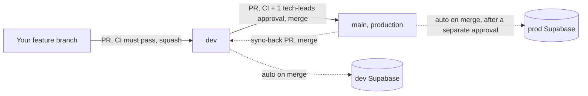

# Contributing

This is the website for Inspire Columbia, a Next.js app with a Supabase database and Clerk for staff authentication. This guide covers what a new contributor needs to get set up and start opening PRs.

## Table of contents

- [Getting started](#getting-started)
  - [Environment setup](#environment-setup)
- [How to contribute code](#how-to-contribute-code)
- [Common commands](#common-commands)
- [Testing](#testing)
  - [Setting up the local Supabase stack](#setting-up-the-local-supabase-stack)
- [Database migrations](#database-migrations)

## Getting started

1. Clone the repo and run `npm install`.
2. Set up your environment (see below) so the app has the credentials it needs to run.
3. Run `npm run dev` and open [http://localhost:3000](http://localhost:3000). If the public pages load, you're set up correctly.

### Environment setup

Copy `.env.example` to a new file called `.env.local` and fill in four values:

- `NEXT_PUBLIC_SUPABASE_URL` and `NEXT_PUBLIC_SUPABASE_PUBLISHABLE_KEY` (from the **dev** Supabase project)
- `NEXT_PUBLIC_CLERK_PUBLISHABLE_KEY` and `CLERK_SECRET_KEY` (from the Clerk **dev instance**)

Ask a `tech-leads` member for these. They're needed just to run `npm run dev` at all, not only for auth- or database-specific work, since Clerk and Supabase are both wired in at the app's root. Without them, the app won't build or start locally.

**Never use production credentials for local development.** The dev Supabase project and Clerk dev instance exist specifically so nothing you do locally can touch real user data.

Two things beyond those four variables, only needed for certain kinds of work:

- **Testing staff/admin functionality** (not just the public pages) requires an actual Clerk user account with a staff role, set up by a `tech-leads` member in the Clerk dashboard. The keys above only let the app run. They don't give any particular account a role.
- **Writing or testing database migrations** doesn't require any shared credentials if you use the local Supabase stack (`supabase start`, see Common commands below). Only pushing a migration to the shared dev project directly requires a personal Supabase CLI login plus the dev project's database password.

## How to contribute code

- `dev` is the default branch. Branch off `dev` for your work, not `main`.
- Open a PR into `dev`. It needs to pass CI (build, typecheck, lint, unit tests) before it can merge, but doesn't need anyone's approval.
- PRs into `dev` are squash merged (the default button), so don't worry about keeping your commit history clean as you work.
- Once your change is on `dev`, it gets promoted to production (`main`) periodically by a `tech-leads` member, via a separate PR that does require an approval. `main`'s merge button only offers a real merge commit, not squash, so each promoted feature stays visible as its own commit.
- Direct pushes to either `dev` or `main` are blocked for everyone, including admins. Everything goes through a PR.
- **After a promotion, sync `main` back into `dev`**: open one more PR (`main` as head, `dev` as base) and merge it using the **merge** method, not the default squash button. This keeps the two branches' git history aligned. Skipping this, or squashing it by mistake, doesn't break anything, but leaves a permanent, confusing gap between the branches that has to be fixed the same way later.

## Common commands

Day to day, you'll mostly just use:

- `npm run dev`: starts the local dev server
- `npm run test:unit`: runs the unit tests, worth running if you touched code that has tests for it

Before opening a PR, it can save you a round trip to run what CI is going to check anyway, so a failure shows up on your machine instead of after you've already pushed:

- `npm run build`
- `npm run lint`

Specialized, only relevant if you're touching the database schema:

- `supabase start` / `supabase stop`: starts or stops a local Postgres/Supabase stack, so you can test migrations without touching the shared dev project
- `npm run test:rls`: database permission tests. Requires that local stack to be running (`supabase start` first). Not run in CI yet.
- `npm run test:e2e`: browser tests that run against the local Supabase stack. Also requires the local stack to be running first. Not run in CI yet.
- `npm run types:gen`: regenerates `lib/database.types.ts` from the schema after a migration change. Run this any time you add a migration. Never hand-edit that file directly.

See [Testing](#testing) below for what each test command actually does and how to set up the local stack the first time.

## Testing

There are three kinds of tests in this repo:

- **Unit tests** (`npm run test:unit`). Test plain TypeScript functions, like form validation. No database needed. These run automatically in CI on every PR.
- **RLS tests** (`npm run test:rls`). Test database permissions, like confirming a regular visitor can't read applicant data but staff can. Needs the local Supabase stack running (see below). Not run in CI yet.
- **End to end tests** (`npm run test:e2e`). Open a real browser and click through the app, like filling out and submitting the application form. Also needs the local Supabase stack running. Not run in CI yet.

Run `npm run test:unit` often, it's fast and needs no setup. Run the other two when you touch the database schema or the application form.

### Setting up the local Supabase stack

You need this for the RLS tests, the end to end tests, or to safely try out a new migration before pushing it.

1. Open Docker Desktop and make sure it's running.
2. Run `supabase start`. The first time you run this it downloads some Docker images, so it can take a few minutes. It sets up a local copy of the database and applies every migration to it.
3. Just wrote a new migration and the stack was already running from before? Run `supabase db reset` instead. This rebuilds the local database from scratch and reapplies every migration in order. `supabase start` on its own won't pick up a new migration on a database that already exists.
4. Run `npm run test:rls` or `npm run test:e2e`.
5. Run `supabase stop` when you're done. You can also just leave it running, that's fine too.

A few things worth knowing:

- `npm run dev` still uses the shared dev Supabase project by default, not your local stack.
- `npm run test:e2e` starts its own dev server on a different port (3100) so it can run at the same time as your own `npm run dev`.
- The seeded `associate-2026` job still has its old Google Form link attached on a fresh local stack. On real dev and prod that link was cleared by hand after the in-house form shipped. The e2e tests clear it automatically, but if you're clicking through the apply form by hand against the local stack, run `update jobs set apply_url = null where slug = 'associate-2026';` first.

## Database migrations

Migration files live in `supabase/migrations/`, named `<timestamp>_<description>.sql`. Once a migration has been merged, don't edit that file. The database has already run it and won't run it again, so add a new migration instead.

Before opening a PR, test a new migration against the [local Supabase stack](#setting-up-the-local-supabase-stack). Run `supabase db reset`, then `npm run test:rls` or `npm run test:e2e`. This is the best way to catch a migration that doesn't apply cleanly, or that breaks an RLS policy, before it ever reaches the shared dev project.

They're applied automatically, not by hand:

- Merging into `dev` applies any new migrations to the dev Supabase project.
- Promoting to `main` applies them to production, after a manual approval step. Schema changes are harder to reverse than a code deploy, so this keeps a human in the loop specifically for that step.

After adding a migration, run `npm run types:gen` to regenerate `lib/database.types.ts`, so the rest of the app has correct types for your schema change.

When writing a migration, prefer expand-style changes over contract-style changes where possible:

- **Expand**: new nullable columns, new tables, widened validation. Safe to land before the code that uses them, since the currently deployed app just ignores schema it doesn't reference yet.
- **Contract**: drops, renames, tightened constraints. These need careful sequencing with the code deploy, since the currently deployed code may still depend on what you're about to remove or rename.
